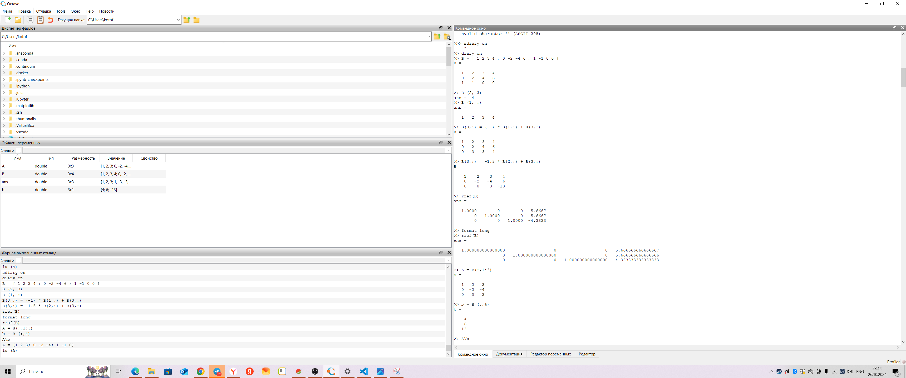

# Цели работы 

1. Воспользоваться сложными алгоритмами для решения систем линейных уравнений в Octave.
2. Применить теоретические знания линейной алгебры на практике.

---

# Задание

1. Решить систему линейных уравнений методом Гаусса.
2. Найти решение системы методом левого деления.
3. Выполнить LU-разложение заданной матрицы.
4. Выполнить LUP-разложение заданной матрицы.
5. Оформить отчет с использованием результатов расчетов и скриншотов выполнения.

---

# Теоретическое введение

### Системы линейных уравнений

Система линейных уравнений — это совокупность уравнений, каждое из которых является линейным относительно переменных. В матричной форме система уравнений может быть записана как:
$$
A \cdot x = b
$$
где \( A \) — матрица коэффициентов, \( x \) — вектор неизвестных, а \( b \) — вектор правых частей.

---

# Теоретическое введение

### Метод Гаусса

Метод Гаусса — один из распространенных методов решения систем линейных уравнений. Его цель — привести матрицу системы к треугольному виду, после чего можно легко найти решения методом обратной подстановки. Процесс решения включает операции сложения и умножения строк на константы для получения нулей под главной диагональю.

---

# Теоретическое введение

### Левое деление

В **Octave** операция левого деления `A\b` позволяет эффективно решать системы линейных уравнений:
$$ 
A \cdot x = b 
$$
Она концептуально эквивалентна \( A^{-1} \cdot b \), но выполняется быстрее и точнее.

---

# Теоретическое введение

### LU-разложение

LU-разложение разбивает матрицу \( A \) на две матрицы:
$$
A = L \cdot U 
$$
где \( L \) — нижняя треугольная, \( U \) — верхняя треугольная матрицы. Этот метод применяется для решения систем линейных уравнений и вычисления определителей.

---

# Теоретическое введение

### LUP-разложение

LUP-разложение — модификация LU-разложения с добавлением перестановочной матрицы \( P \), которая учитывает перестановку строк для повышения устойчивости вычислений.

---

# Выполнение лабораторной работы

### Метод Гаусса

1. **Задание**: Решить систему уравнений:
   $$
   A \cdot x = b, \quad A = \begin{pmatrix} 1 & 2 & 3 \\ 0 & -2 & -4 \\ 1 & -1 & 0 \end{pmatrix}, \quad b = \begin{pmatrix} 4 \\ 6 \\ 0 \end{pmatrix}
   $$

---

# Выполнение лабораторной работы

### Метод Гаусса (продолжение)

2. **Расширенная матрица**:
   ```octave
   B = [1, 2, 3, 4; 0, -2, -4, 6; 1, -1, 0, 0]

---
 **Скриншот выполнения**:
    

---
**Скриншот 2**
    