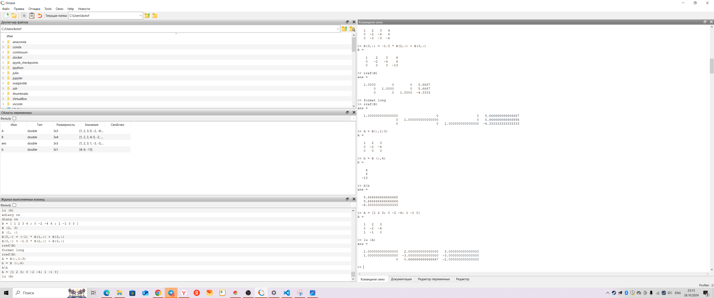

---
## Front matter
title: "Отчет по Лабораторной работе №3 по предмету Научное программирование"
author: "Лобов Михаил Сергеевич"

## Generic otions
lang: ru-RU
toc-title: "Содержание"

## Bibliography
bibliography: bib/cite.bib
csl: pandoc/csl/gost-r-7-0-5-2008-numeric.csl

## Pdf output format
toc: true # Table of contents
toc-depth: 2
lof: true # List of figures
lot: true # List of tables
fontsize: 12pt
linestretch: 1.5
papersize: a4
documentclass: scrreprt
## I18n polyglossia
polyglossia-lang:
  name: russian
  options:
    - spelling=modern
    - babelshorthands=true
polyglossia-otherlangs:
  name: english
## I18n babel
babel-lang: russian
babel-otherlangs: english
## Fonts
mainfont: IBM Plex Serif
romanfont: IBM Plex Serif
sansfont: IBM Plex Sans
monofont: IBM Plex Mono
mathfont: STIX Two Math
mainfontoptions: Ligatures=Common,Ligatures=TeX,Scale=0.94
romanfontoptions: Ligatures=Common,Ligatures=TeX,Scale=0.94
sansfontoptions: Ligatures=Common,Ligatures=TeX,Scale=MatchLowercase,Scale=0.94
monofontoptions: Scale=MatchLowercase,Scale=0.94,FakeStretch=0.9
mathfontoptions:
## Biblatex
biblatex: true
biblio-style: "gost-numeric"
biblatexoptions:
  - parentracker=true
  - backend=biber
  - hyperref=auto
  - language=auto
  - autolang=other*
  - citestyle=gost-numeric
## Pandoc-crossref LaTeX customization
figureTitle: "Рис."
tableTitle: "Таблица"
listingTitle: "Листинг"
lofTitle: "Список иллюстраций"
lotTitle: "Список таблиц"
lolTitle: "Листинги"
## Misc options
indent: true
header-includes:
  - \usepackage{indentfirst}
  - \usepackage{float} # keep figures where there are in the text
  - \floatplacement{figure}{H} # keep figures where there are in the text
---

# Цели работы 

1. Воспользоваться сложными алгоритмами для решения систем линейных уравнений в Octave.
2. Применить теоретические знания линейной алгебры на практике.
   
# Задание

1. Решить систему линейных уравнений методом Гаусса.
2. Найти решение системы методом левого деления.
3. Выполнить LU-разложение заданной матрицы.
4. Выполнить LUP-разложение заданной матрицы.
5. Оформить отчет с использованием результатов расчетов и скриншотов выполнения.

# Теоретическое введение

### Системы линейных уравнений

Система линейных уравнений — это совокупность уравнений, каждое из которых является линейным относительно переменных. В матричной форме система уравнений может быть записана как:
$$
A \cdot x = b
$$
где \( A \) — матрица коэффициентов, \( x \) — вектор неизвестных, а \( b \) — вектор правых частей.

### Метод Гаусса

Метод Гаусса (или метод прямого исключения) — один из наиболее распространенных методов решения систем линейных уравнений. Его цель — привести матрицу системы к треугольному виду, после чего можно легко найти решения системы методом обратной подстановки. Процесс решения включает операции сложения и умножения строк на константы для получения нулей под главной диагональю.

### Левое деление

В **Octave** операция левого деления `A\b` позволяет быстро и эффективно находить решение для системы линейных уравнений
$$ 
A \cdot x = b 
$$
Концептуально эта операция эквивалентна умножению на обратную матрицу
$$ 
A^{-1} \cdot b 
$$
  но выполняется быстрее и точнее.

### LU-разложение

LU-разложение разбивает исходную матрицу \( A \) на две матрицы: \( L \) (нижнюю треугольную) и \( U \) (верхнюю треугольную), такие, что
$$
A = L \cdot U 
$$
  Этот метод широко применяется для решения систем линейных уравнений и вычисления определителей.

### LUP-разложение

LUP-разложение представляет собой модификацию LU-разложения, в которой к матрицам \( L \) и \( U \) добавляется перестановочная матрица \( P \), учитывающая перестановку строк для получения точного результата. LUP-разложение часто используется для повышения устойчивости вычислений.

# Выполнение лабораторной работы

### Метод Гаусса

1. **Задание**: Решить систему линейных уравнений:
   $$
   A \cdot x = b, \quad A = \begin{pmatrix} 1 & 2 & 3 \\ 0 & -2 & -4 \\ 1 & -1 & 0 \end{pmatrix}, \quad b = \begin{pmatrix} 4 \\ 6 \\ 0 \end{pmatrix}
   $$
2. **Расширенная матрица**: Создаём расширенную матрицу:
```octave
   B = [1, 2, 3, 4; 0, -2, -4, 6; 1, -1, 0, 0]
```
# Выполнение лабораторной работы

### Метод Гаусса

1. **Задание**: Решить систему линейных уравнений:
   $$
   A \cdot x = b, \quad A = \begin{pmatrix} 1 & 2 & 3 \\ 0 & -2 & -4 \\ 1 & -1 & 0 \end{pmatrix}, \quad b = \begin{pmatrix} 4 \\ 6 \\ 0 \end{pmatrix}
   $$
2. **Расширенная матрица**: Создаём расширенную матрицу:
   ```octave
   B = [1, 2, 3, 4; 0, -2, -4, 6; 1, -1, 0, 0]
   ```
3. **Приведение к треугольному виду**:
   - Добавляем к третьей строке первую, умноженную на -1:
     ```octave
     B(3, :) = -1 * B(1, :) + B(3, :)
     ```
   - Добавляем ко второй строке первую строку, умноженную на -1.5:
     ```octave
     B(3, :) = -1.5 * B(2, :) + B(3, :)
     ```
   В итоге получаем треугольную матрицу и можем выполнить обратную подстановку для нахождения решения.

4. **Результат**:
   Решение системы
    $$ 
    x = \begin{pmatrix} \frac{17}{3} \\ \frac{17}{3} \\ -\frac{13}{3} \end{pmatrix} 
    $$

### Метод левого деления

1. **Исходная матрица**: Из расширенной матрицы \( B \) выделяем матрицу \( A \) и вектор \( b \):
   ```octave
   A = B(:, 1:3);
   b = B(:, 4);
   ```
2. **Решение**:
   Находим вектор решений с использованием операции левого деления:
   ```octave
   x = A\b
   ```
3. **Результат**:
   Решение системы совпадает с результатом, полученным методом Гаусса:
   $$
   x = \begin{pmatrix} 5.6667 \\ 5.6667 \\ -4.3333 \end{pmatrix}
   $$
4. **Скриншот выполнения**:
    
    


### LU-разложение

1. **Определение матрицы**:
   ```octave
   A = [1, 2, 3; 0, -2, -4; 1, -1, 0];
   ```
2. **LU-разложение**:
   В **Octave** для выполнения LU-разложения используется встроенная команда:
   ```octave
   [L, U] = lu(A);
   ```
3. **Результат**:
   Матрица \( A \) разложена на \( L \) и \( U \), которые могут быть использованы для решения системы.

### LUP-разложение

1. **Определение матрицы**:
   ```octave
   A = [1, 2, 3; 0, -2, -4; 1, -1, 0];
   ```
2. **LUP-разложение**:
   Выполняем разложение с учетом перестановки строк:
   ```octave
   [L, U, P] = lu(A);
   ```
3. **Результат**:
   Получено LUP-разложение исходной матрицы с учетом перестановочной матрицы \( P \).

# Выводы

В ходе выполнения лабораторной работы были изучены различные методы решения систем линейных уравнений. Метод Гаусса и операция левого деления показали себя как эффективные способы решения, в то время как LU и LUP-разложения предоставили более глубокое понимание структуры матрицы и методов её анализа. Каждый из методов имеет свои преимущества и может быть использован в зависимости от условий задачи.

# Список литературы

1. Кулябов, Д. С., Королькова, А. В. Введение в научное программирование. — М.: Физматлит, 2020.
2. [Octave Documentation: Matrix Division](https://octave.org/doc/v4.0.0/Matrix-Division.html)