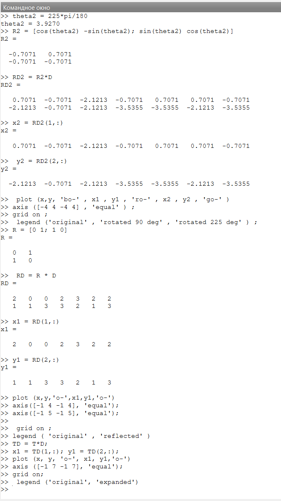

# Цели работы

Цель данной лабораторной работы — изучить методы подгонки полиномиальных кривых к набору данных и применить различные матричные преобразования, такие как вращение, отражение и дилатация, с использованием языка программирования Octave.

---

# Задание

1. Подогнать параболическую кривую к набору точек методом наименьших квадратов.
2. Выполнить матричные преобразования (вращение, отражение, дилатация) для заданного графа.
3. Составить отчет в форматах PDF, DOCX и MD.

---

# Теоретическое введение

В работе используются следующие математические методы:
- **Метод наименьших квадратов** для подгонки параболы к данным.
- **Матричные преобразования**: вращение, отражение, и масштабирование.

---

# Выполнение лабораторной работы

### Подгонка полиномиальной кривой

```octave
D = [1 1; 2 2; 3 5; 4 4; 5 2; 6 -3];
xdata = D(:,1);
ydata = D(:,2);

A = ones(6,3);
A(:,1) = xdata .^ 2;
A(:,2) = xdata;

coeff = (A' * A) \ (A' * ydata);
a = coeff(1);
b = coeff(2);
c = coeff(3);

x = linspace(0, 7, 50);
y = a * x .^ 2 + b * x + c;
plot(xdata, ydata, 'o', x, y, 'linewidth', 2);
```

---

# Выполнение лабораторной работы

### Вращение графа на 90° и 225°

```octave
theta1 = 90 * pi / 180;
R1 = [cos(theta1) -sin(theta1); sin(theta1) cos(theta1)];
RD1 = R1 * D;

theta2 = 225 * pi / 180;
R2 = [cos(theta2) -sin(theta2); sin(theta2) cos(theta2)];
RD2 = R2 * D;

plot(D(1,:), D(2,:), 'bo-', RD1(1,:), RD1(2,:), 'ro-', RD2(1,:), RD2(2,:), 'go-');
```

---

# Выполнение лабораторной работы

### Отражение графа относительно прямой \( y = x \)

```octave
R = [0 1; 1 0];
RD = R * D;

plot(D(1,:), D(2,:), 'o-', RD(1,:), RD(2,:), 'o-');
```

---

# Выполнение лабораторной работы

### Дилатация (масштабирование)

```octave
T = [2 0; 0 2];
TD = T * D;

plot(D(1,:), D(2,:), 'o-', TD(1,:), TD(2,:), 'o-');
```

---

# Скриншоты и графики

### График 1


---

### График 2


---

### График 3


---

### График 4


---

### График 5


---

### График 6


---

### График 7



---

# Выводы

- Изучены методы подгонки кривой и матричные преобразования.
- Реализованы методы: подгонка параболы методом наименьших квадратов, вращение, отражение, и масштабирование графа.
- Данные методы применимы в различных областях, таких как обработка изображений и анализ данных.

---

# Список литературы

1. Кулябов, Д. С., Королькова, А. В. Введение в научное программирование. — М.: Физматлит, 2020.
2. [Octave Documentation: Matrix Division](https://octave.org/doc/v4.0.0/Matrix-Division.html)
```

Эта презентация разбивает отчет на слайды и размещает каждый скриншот или график на отдельном слайде.