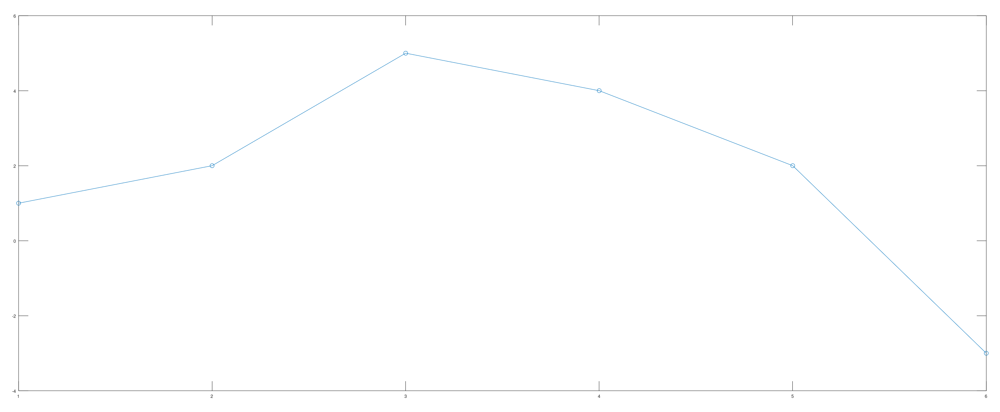
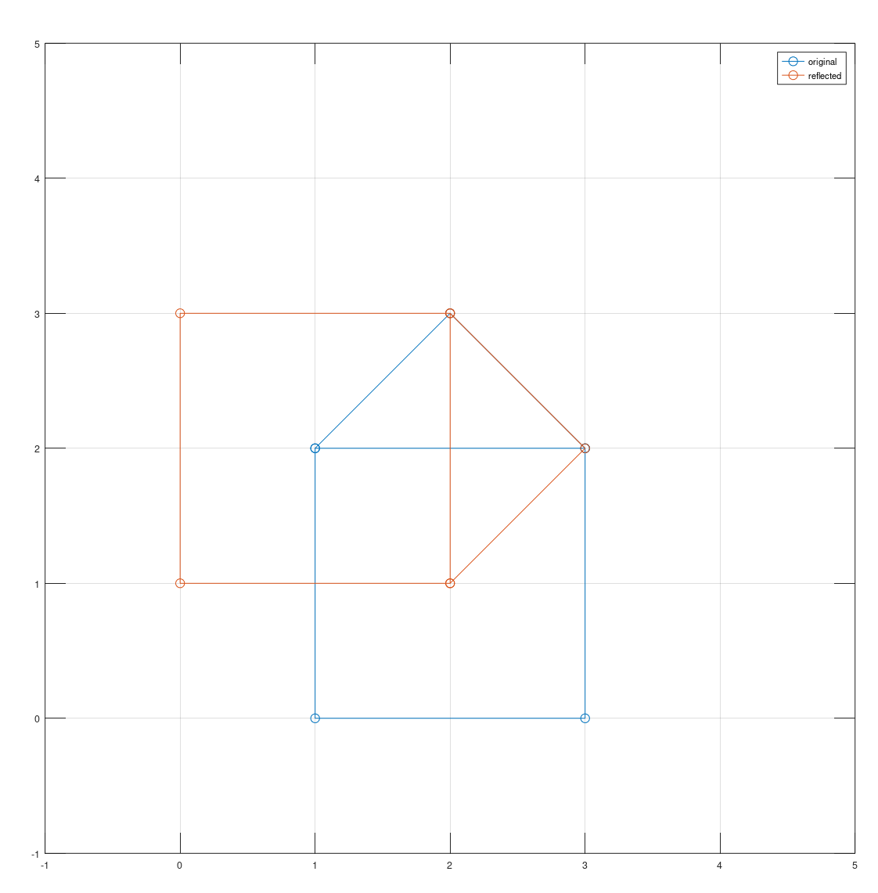
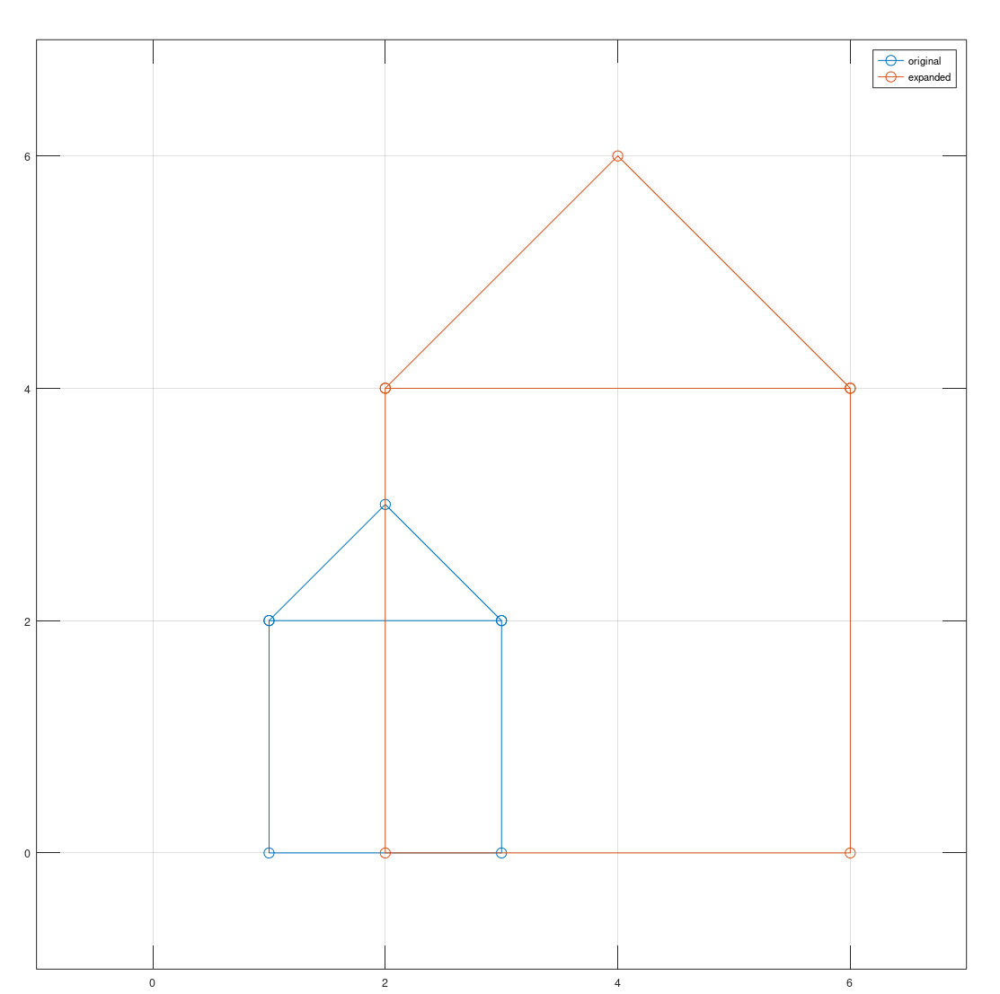

---
## Front matter
title: "Отчет по Лабораторной работе №3 по предмету Научное программирование"
author: "Лобов Михаил Сергеевич"

## Generic otions
lang: ru-RU
toc-title: "Содержание"

## Bibliography
bibliography: bib/cite.bib
csl: pandoc/csl/gost-r-7-0-5-2008-numeric.csl

## Pdf output format
toc: true # Table of contents
toc-depth: 2
lof: true # List of figures
lot: true # List of tables
fontsize: 12pt
linestretch: 1.5
papersize: a4
documentclass: scrreprt
## I18n polyglossia
polyglossia-lang:
  name: russian
  options:
    - spelling=modern
    - babelshorthands=true
polyglossia-otherlangs:
  name: english
## I18n babel
babel-lang: russian
babel-otherlangs: english
## Fonts
mainfont: IBM Plex Serif
romanfont: IBM Plex Serif
sansfont: IBM Plex Sans
monofont: IBM Plex Mono
mathfont: STIX Two Math
mainfontoptions: Ligatures=Common,Ligatures=TeX,Scale=0.94
romanfontoptions: Ligatures=Common,Ligatures=TeX,Scale=0.94
sansfontoptions: Ligatures=Common,Ligatures=TeX,Scale=MatchLowercase,Scale=0.94
monofontoptions: Scale=MatchLowercase,Scale=0.94,FakeStretch=0.9
mathfontoptions:
## Biblatex
biblatex: true
biblio-style: "gost-numeric"
biblatexoptions:
  - parentracker=true
  - backend=biber
  - hyperref=auto
  - language=auto
  - autolang=other*
  - citestyle=gost-numeric
## Pandoc-crossref LaTeX customization
figureTitle: "Рис."
tableTitle: "Таблица"
listingTitle: "Листинг"
lofTitle: "Список иллюстраций"
lotTitle: "Список таблиц"
lolTitle: "Листинги"
## Misc options
indent: true
header-includes:
  - \usepackage{indentfirst}
  - \usepackage{float} # keep figures where there are in the text
  - \floatplacement{figure}{H} # keep figures where there are in the text
---

# Цели работы
Цель данной лабораторной работы — изучить методы подгонки полиномиальных кривых к набору данных и применить различные матричные преобразования, такие как вращение, отражение и дилатация, с использованием языка программирования Octave.

# Задание
1. Подогнать параболическую кривую к набору точек методом наименьших квадратов.
2. Выполнить матричные преобразования (вращение, отражение, дилатация) для заданного графа.
3. Составить отчет в форматах PDF, DOCX и MD.

# Теоретическое введение
В ходе работы используются следующие математические методы и операции:

- **Метод наименьших квадратов**: Метод используется для подгонки кривой к данным. Парабола вида \( y = ax^2 + bx + c \) подгоняется к набору точек. Для этого составляется система линейных уравнений и решается методом наименьших квадратов.
  
- **Матричные преобразования**:
  - **Вращение**: Выполняется при помощи умножения матрицы точек на матрицу вращения \( R \), определяемую углом поворота \( \theta \).
  - **Отражение**: Осуществляется относительно заданной прямой с помощью специальной матрицы отражения.
  - **Дилатация (масштабирование)**: Реализуется умножением на матрицу, определяющую коэффициент увеличения или уменьшения.

# Выполнение лабораторной работы

### Подгонка полиномиальной кривой
Введем данные точек и построим параболу методом наименьших квадратов:
```octave
D = [1 1; 2 2; 3 5; 4 4; 5 2; 6 -3];
xdata = D(:,1);
ydata = D(:,2);

% Построение матрицы коэффициентов
A = ones(6,3);
A(:,1) = xdata .^ 2;
A(:,2) = xdata;

% Решение уравнения методом наименьших квадратов
coeff = (A' * A) \ (A' * ydata);
a = coeff(1);
b = coeff(2);
c = coeff(3);

% Построение графика
x = linspace(0, 7, 50);
y = a * x .^ 2 + b * x + c;
plot(xdata, ydata, 'o', x, y, 'linewidth', 2);
grid on;
legend('data values', 'least-squares parabola');
title(sprintf('y = %.5fx^2 + %.5fx + %.5f', a, b, c));
```

### Вращение графа
Выполним вращение графа на 90° и 225° с помощью матрицы вращения:
```octave
% Поворот на 90 градусов
theta1 = 90 * pi / 180;
R1 = [cos(theta1) -sin(theta1); sin(theta1) cos(theta1)];
RD1 = R1 * D;

% Поворот на 225 градусов
theta2 = 225 * pi / 180;
R2 = [cos(theta2) -sin(theta2); sin(theta2) cos(theta2)];
RD2 = R2 * D;

% Построение графика
plot(D(1,:), D(2,:), 'bo-', RD1(1,:), RD1(2,:), 'ro-', RD2(1,:), RD2(2,:), 'go-');
axis equal;
grid on;
legend('original', 'rotated 90°', 'rotated 225°');
```

### Отражение графа
Выполним отражение графа относительно прямой \( y = x \):
```octave
R = [0 1; 1 0];
RD = R * D;

% Построение графика
plot(D(1,:), D(2,:), 'o-', RD(1,:), RD(2,:), 'o-');
axis equal;
grid on;
legend('original', 'reflected');
```

### Дилатация (масштабирование)
Увеличим граф в два раза:
```octave
T = [2 0; 0 2];
TD = T * D;

% Построение графика
plot(D(1,:), D(2,:), 'o-', TD(1,:), TD(2,:), 'o-');
axis equal;
grid on;
legend('original', 'expanded');
```
## Скриншоты и графики

В этом разделе представлены скриншоты и графики, полученные в ходе выполнения лабораторной работы.










# Выводы
В ходе выполнения лабораторной работы были изучены и реализованы методы подгонки кривой и различные матричные преобразования, которые играют важную роль в анализе данных и компьютерной графике. Метод наименьших квадратов был применен для подгонки полинома к набору точек, а также реализованы операции вращения, отражения и масштабирования графа. Данные методы важны для обработки графических объектов и используются в различных областях, включая обработку изображений и анализ данных.

# Список литературы
1. Кулябов, Д. С., Королькова, А. В. Введение в научное программирование. — М.: Физматлит, 2020.
2. [Octave Documentation: Matrix Division](https://octave.org/doc/v4.0.0/Matrix-Division.html)