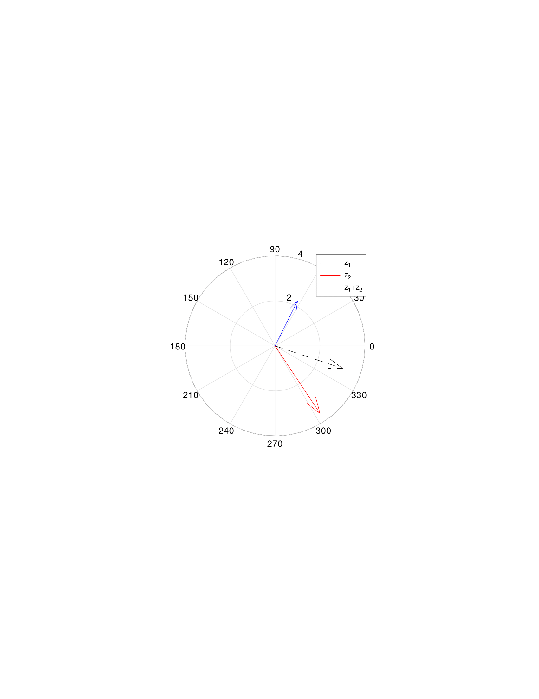
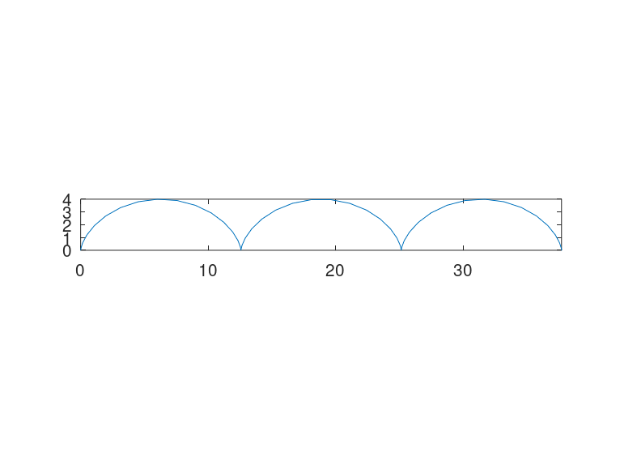
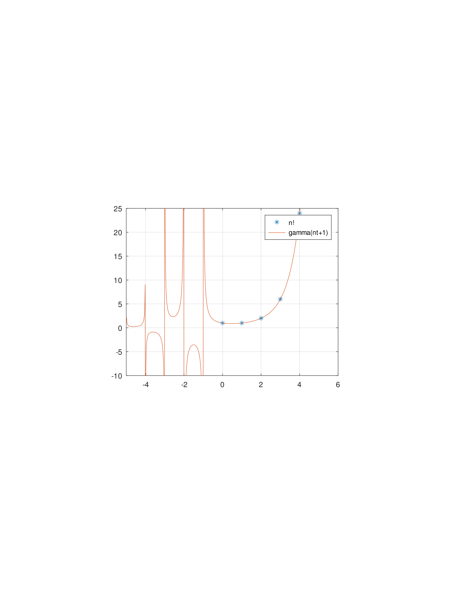
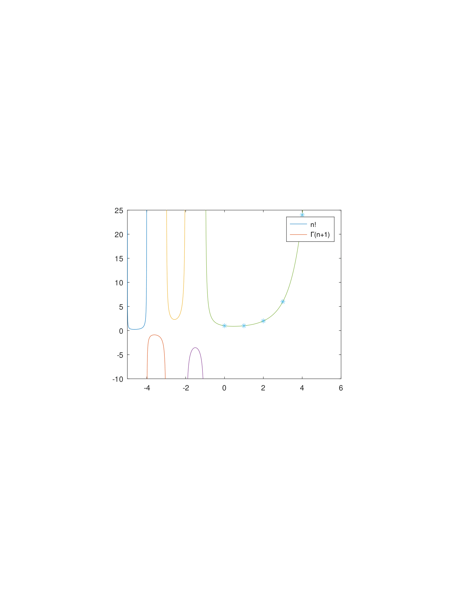
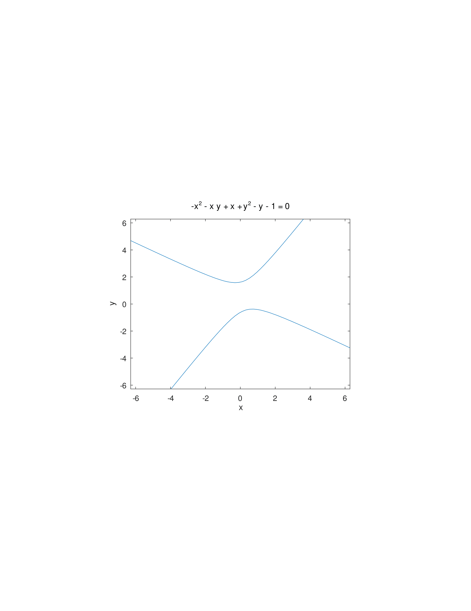
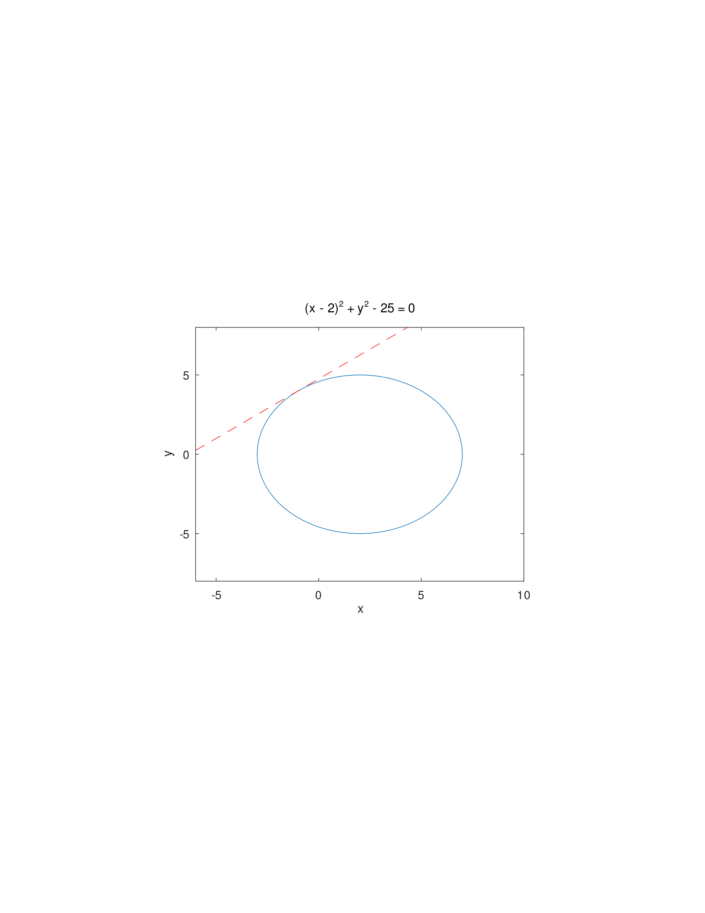
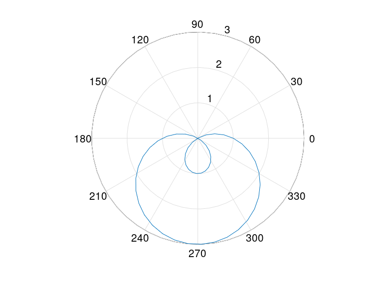
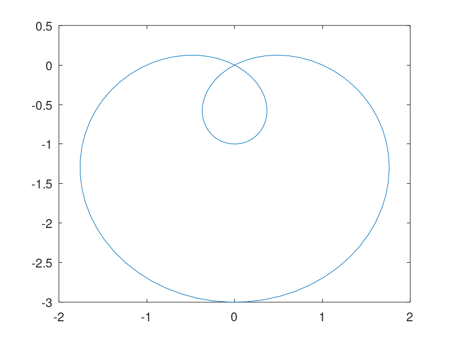

**Отчёт по выполнению лабораторной работы**

**1. Цель работы**  
Целью данной лабораторной работы является ознакомление с возможностями программного пакета Octave для построения различных типов графиков и визуализации математических функций. В ходе работы мы исследуем методы построения параметрических кривых, графиков в полярных координатах, неявно заданных функций, а также рассмотрим способы работы с комплексными числами и специальными функциями (в частности, гамма-функцией). Таким образом, мы отработаем навыки графической визуализации, анализа и интерпретации полученных данных, что является важной составляющей математического моделирования и исследования функций в среде Octave.

**2. Задание**  
В рамках задания необходимо:  
- Построить параметрические графики (например, циклоиду), продемонстрировав использование параметрических уравнений для вывода сложных кривых.  
- Выполнить построение графиков в полярных координатах для кривых, заданных в виде $(r, \theta)$.  
- Реализовать визуализацию неявно заданных функций с использованием встроенных инструментов Octave.  
- Исследовать операции с комплексными числами и их графическую интерпретацию, в частности, сложение и умножение комплексных величин, а также их геометрическую репрезентацию на комплексной плоскости.  
- Рассмотреть использование специальных функций, в том числе гамма-функции $\Gamma(x)$, и сравнить её значения с факториалом $n!$ в соответствующих точках.

**3. Теоретическое введение**  
**Построение параметрических графиков:**  
Параметрические уравнения позволяют задавать зависимости координат $x$ и $y$ от дополнительного параметра $t$. Например, циклоидная кривая может быть задана как  
$$
x(t) = r(t - \sin t), \quad y(t) = r(1 - \cos t),
$$ 
где $r$  – радиус генерирующего круга, а $t$ – параметр (обычно, угол поворота). Параметрические графики удобны для исследования кривых, полученных в результате движения точки.

**Построение графиков в полярных координатах:**  
Полярные координаты выражают точку на плоскости через радиус $r$ и угол  $\theta$ . Функции вида $r = f(\theta)$ позволяют строить красивые кривые, недоступные в элементарном декартовом представлении. Octave обеспечивает функции для конвертации и визуализации таких данных, позволяя наглядно исследовать формы кривых.

**Неявные функции и их графики:**  
Неявно заданными функциями называются уравнения вида $F(x,y)=0$, в которых нет явного выражения $y$ через $x$. Построение графиков таких функций требует численных методов или встроенных процедур (например, `ezplot`), чтобы отобразить множество точек $(x,y)$, удовлетворяющих уравнению.

**Графики комплексных чисел:**  
Комплексные числа $z = x + yi$ можно интерпретировать как точки или векторы на комплексной плоскости. Визуализация таких чисел помогает наглядно представлять операции над ними, например, сложение, вычитание, умножение и деление. Инструмент `compass` в Octave позволяет графически отразить направление и длину вектора, соответствующего комплексному числу.

**Специальные функции: гамма-функция:**  
Гамма-функция $\Gamma(x)$ является обобщением факториала на вещественную (или даже комплексную) область чисел. Для натуральных чисел $n$ справедливо:  
$$
\Gamma(n+1) = n!,
$$ 
но гамма-функция определена и для нецелых аргументов. Исследование графика $\Gamma(x)$ даёт представление о её поведении на различных интервалах, в том числе в отрицательной области, где функция имеет полюса.

**4. Выполнение лабораторной работы**  
Ниже приводится используемый код Octave. Для удобства в отчёт будут добавлены графики в виде скриншотов результатов работы (в реальной версии отчёта следует вставить соответствующие изображения):

```octave
% Параметрические графики
t = linspace (0,6*pi,50);
r = 2;
x = r*(t - sin(t));
y = r*(1 - cos(t));
plot (x,y)
axis('equal');
axis([0 12*pi 0 4])
savefig cycloid.pdf
print -dpdf cycloid.pdf
print -dpng cycloid.png

% Графики в полярных координатах
theta = linspace (0,2*pi,100);
r = 1-2*sin(theta);
x = r.*cos(theta);
y = r.*sin(theta);
plot (x,y)
print -dpdf limacon.pdf
print -dpng llimacon.png

theta = linspace(0,2*pi,50);
r = 1-2*sin(theta);
polar(theta,r)
print -dpdf limacon-polar.pdf
print -dpng llimacon-polar.png

% Графики неявных функций
f = @(x,y) -x.^2 - x.*y + x + y.^2 - y - 1;
ezplot(f)
print -dpdf impl1.pdf

f = @(x,y) (x-2).^2 + y.^2 - 25;
ezplot(f, [-6 10 -8 8])
x = [-6:10];
y = 3/4*x + 19/4;
hold on
plot(x,y,'r--')
print -dpdf impl2.pdf

% Операции с комплексными числами
z1 = 1+2*i;
z2 = 2-3*i;
z1+z2
z1-z2
z1*z2
z1/z2

clf
z1 = 1+2*i;
z2 = 2-3*i;
compass(z1,'b')
hold on
compass(z2,'r')
compass(z1+z2,'k--')
legend('z_1','z_2','z_1+z_2')
print -dpdf complex.pdf

(-8)^(1/3)
ans^3
nthroot(-8,3)

% Специальные функции (Гамма-функция)
n = [0:1:5];
x = linspace(-5,5,500);
plot(n, factorial(n), '*', x, gamma(x+1))
clf
plot(n, factorial(n),'*', x, gamma(x+1))
axis([-5 6 -10 25]);
grid on;
legend('n!', 'gamma(n+1)')
print -dpdf gamma.pdf

% То же самое но по отдельным интервалам
clf
x1 = linspace(-5,-4,500);
x2 = linspace(-4,-3,500);
x3 = linspace(-3,-2,500);
x4 = linspace(-2,-1,500);
x5 = linspace(-1,5,500);
plot(x1,gamma(x1+1))
hold on
plot(x2,gamma(x2+1))
plot(x3,gamma(x3+1))
plot(x4,gamma(x4+1))
plot(x5,gamma(x5+1))
axis([-5 6 -10 25]);
plot (n,factorial(n),'*')
legend('n!',"\\Gamma(n+1)")
print -dpdf gamma2.pdf
```
#### Графики

















В приведенном коде:  
- Используются команды `linspace` для формирования равномерных сеток по аргументу.  
- Параметрические кривые, неявные функции и графики в полярных координатах строятся с помощью функций `plot`, `polar`, `ezplot`.  
- Применяется функция `compass` для отображения комплексных чисел на комплексной плоскости.  
- Используются функции `factorial` и `gamma` для анализа и сравнения факториала и гамма-функции.  
- Готовые результаты сохраняются в файлы форматов `.pdf` и `.png` с помощью команд `print`.

Все полученные графики были сохранены и могут быть включены в отчёт для наглядной демонстрации результатов.

**5. Выводы**  
В ходе выполненной лабораторной работы мы освоили основные методы визуализации математических объектов в среде Octave. Параметрические графики позволяют исследовать сложные кривые, заданные через промежуточный параметр. Графики в полярных координатах обеспечивают удобный инструмент для анализа форм кривых, естественно заданных через радиус и угол. Использование функций для построения неявных графиков существенно облегчает анализ сложных уравнений. Наглядная интерпретация комплексных чисел в виде векторов на плоскости помогает лучше понять операции над ними. Наконец, сравнение факториала и гамма-функции демонстрирует расширение понятий элементарных функций на континуум вещественной оси. Таким образом, работа продемонстрировала широкие возможности Octave в визуализации и анализе математических данных.

**6. Список литературы**  
1. Eaton, J. W., Bateman, D., Hauberg, S., & Wehbring, R. (2017). *GNU Octave Manual Version 4*. Free Software Foundation.  
2. Official GNU Octave documentation: [https://docs.octave.org](https://docs.octave.org)  
3. Weisstein, Eric W. "Gamma Function." *From MathWorld--A Wolfram Web Resource.* [https://mathworld.wolfram.com/GammaFunction.html](https://mathworld.wolfram.com/GammaFunction.html)  
4. Higham, N. J. (2002). *Accuracy and Stability of Numerical Algorithms.* Society for Industrial and Applied Mathematics.  
5. Press, W. H., Teukolsky, S. A., Vetterling, W. T., & Flannery, B. P. (2007). *Numerical Recipes: The Art of Scientific Computing*. Cambridge University Press.